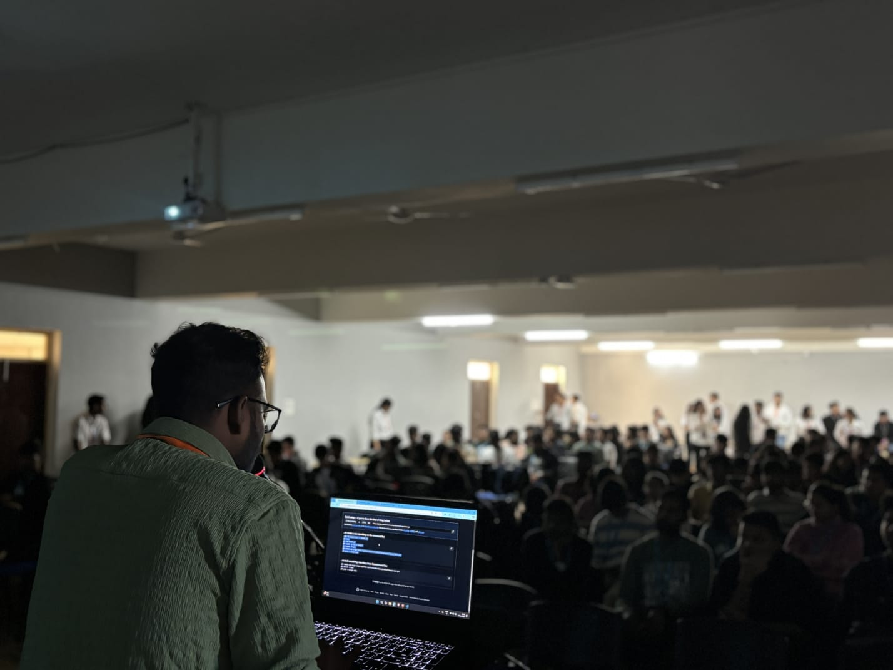
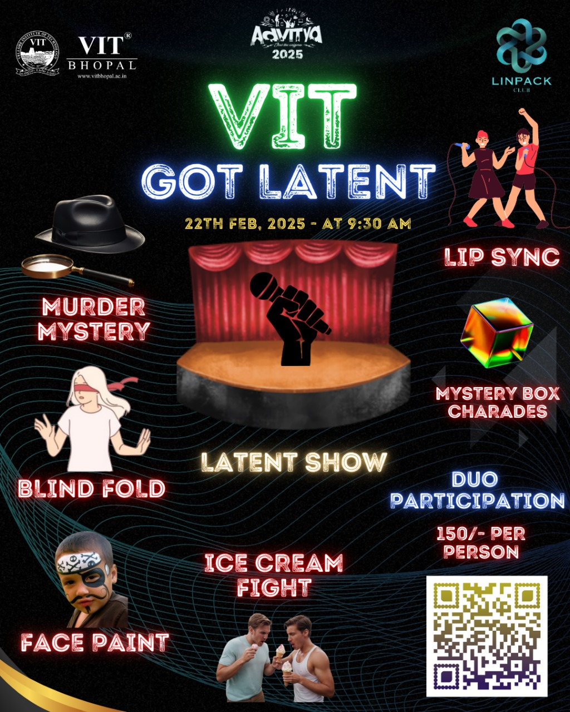
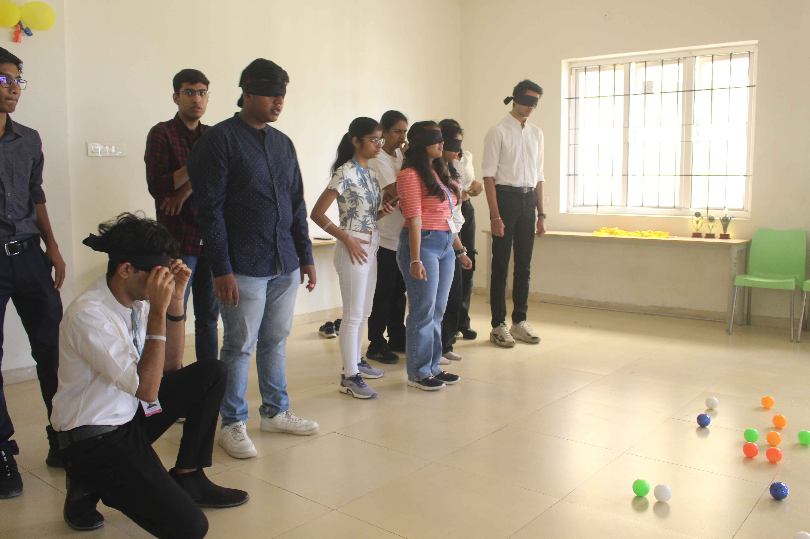
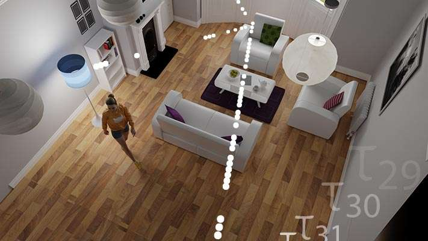

# 🎓 MATLAB & Overleaf Club Website

[](https://nextjs.org/)
[](https://www.typescriptlang.org/)
[](https://tailwindcss.com/)
[](https://www.framer.com/motion/)
[](https://greensock.com/gsap/)
[](LICENSE)
[](https://vercel.com/)

A modern, responsive website for the MATLAB & Overleaf Club at VIT Bhopal University. This platform provides students with access to exclusive resources, event registrations, certificate generation, and interactive learning materials.

## 🖼️ Preview

<div align="center">
  
  
  <br/>
  
  
</div>

## 🌟 Key Features

| Feature | Description |
|--------|-------------|
| **Event Registration** | Seamless registration for club events with QR code ticket generation |
| **Certificate Generation** | Automated certificate creation for event participants |
| **QR Code Scanner** | Verification system for tickets and certificates |
| **Interactive Tutorials** | Hands-on learning resources for MATLAB and Overleaf |
| **Research Showcase** | Highlighting cutting-edge research in signal processing, AI, and robotics |
| **Responsive Design** | Fully responsive layout that works on all devices |
| **Dark Mode** | Eye-friendly dark theme with AMOLED black support |

## 🛠️ Technology Stack

| Category | Technology |
|----------|------------|
| **Frontend** | Next.js 15, TypeScript, Tailwind CSS |
| **Animations** | Framer Motion, GSAP |
| **State Management** | React Context API |
| **UI Components** | Radix UI, Heroicons, Lucide React |
| **Backend** | FastAPI (Python) |
| **Database** | JSON-based data storage |
| **Deployment** | Vercel |
| **Package Manager** | pnpm |

## 🚀 Getting Started

First, install the dependencies:

```bash
pnpm install
```

Then, run the development server:

```bash
pnpm dev
```

Open [http://localhost:3000](http://localhost:3000) with your browser to see the result.

The development server runs both the Next.js frontend and FastAPI backend concurrently.

### Environment Variables

Create a `.env.local` file in the root directory with the following variables:

```env
NEXT_PUBLIC_API_URL=http://localhost:8000/
```

## 📁 Project Structure

```bash
club-website/
├── app/                    # Next.js app router pages
├── components/             # Reusable UI components
│   ├── book/               # Interactive book component
│   ├── carousel/           # Image carousel components
│   ├── certificate/        # Certificate generation UI
│   ├── chat/               # Chatbot interface
│   ├── event/              # Event ticketing system
│   ├── hero/               # Hero section components
│   ├── navbar/             # Navigation components
│   ├── research/           # Research showcase sections
│   ├── section/            # Homepage sections
│   ├── toggle/             # Toggle switch components
│   ├── tutorial/           # Tutorial components
│   ├── ui/                 # Generic UI components
│   └── video/              # Video components
├── public/                 # Static assets
│   └── images/             # Image assets
├── api/                    # FastAPI backend
│   └── assets/             # Data files
├── hooks/                  # Custom React hooks
├── lib/                    # Utility functions
└── styles/                 # Global styles
```

## 🎯 Core Functionality

### Event Ticketing System
- Generate event tickets with unique QR codes
- Download tickets as PNG images
- Verify tickets using the QR scanner

### Certificate Generation
- Create personalized certificates for event participants
- Automatic download of generated certificates
- QR code verification system

### Research Showcase
- Interactive research topic displays
- Links to external research publications
- Animated transitions between research topics

### Tutorials & Learning
- Step-by-step guides for MATLAB and Overleaf
- Interactive components for hands-on learning
- Visual demonstrations of key concepts

## 🌐 Deployment

The easiest way to deploy your Next.js app is to use the [Vercel Platform](https://vercel.com/new) from the creators of Next.js.

Check out our [Next.js deployment documentation](https://nextjs.org/docs/deployment) for more details.

### Build for Production

```bash
pnpm build
```

### Start Production Server

```bash
pnpm start
```

## 🤝 Contributing

Contributions are what make the open source community such an amazing place to learn, inspire, and create. Any contributions you make are **greatly appreciated**.

1. Fork the Project
2. Create your Feature Branch (`git checkout -b feature/AmazingFeature`)
3. Commit your Changes (`git commit -m 'Add some AmazingFeature'`)
4. Push to the Branch (`git push origin feature/AmazingFeature`)
5. Open a Pull Request

## 📄 License

This project is licensed under the MIT License - see the [LICENSE](LICENSE) file for details.

## 📧 Contact

For any queries, please contact the club at [linpack@vitbhopal.ac.in](mailto:linpack@vitbhopal.ac.in)

---

<p align="center">
  Made with ❤️ by the MATLAB & Overleaf Club, VIT Bhopal University
</p>